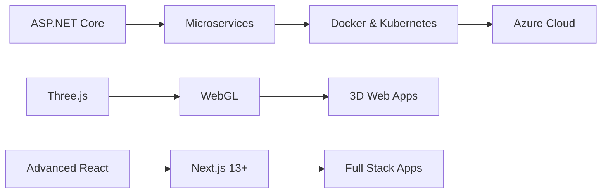

<div align="center">

# 👋 Welcome to Aniruddh's Digital Universe!


</div>

## 🧑‍💻 About Me

```javascript
const aniruddh = {
    pronouns: "He/Him",
    location: "India 🇮🇳",
    currentFocus: ["ASP.NET Core", "Three.js", "Microservices", "Cloud Architecture"],
    askMeAbout: ["React", "GSAP", "Tailwind CSS", "C#", "Backend Development"],
    funFact: "I turn coffee ☕ into code and bugs into features! 🐛➡️✨",
    motto: "Code with passion, debug with patience! 💪"
};
```


### 🚀 What I'm Up To

- 🔭 **Currently Building:** Full-stack applications with **ASP.NET Core** & **React**
- 🌱 **Learning Journey:** Advanced **Three.js**, **Microservices Architecture**, **Azure Cloud**
- 🎯 **2024 Goals:** Master cloud deployment, contribute to open source, build 5 major projects
- 💡 **Fun Projects:** Interactive 3D web experiences, Real-time applications
- 🤝 **Open to:** Collaborate on innovative web applications and 3D projects
- 📧 **Reach me:** aniruddhsharma8877@gmail.com

<br clear="right"/>

## 🛠️ Tech Arsenal

### 💻 **Frontend Magic**
<div align="center">


</div>

### 🎨 **Styling & Animation**
<div align="center">


</div>

### ⚙️ **Backend Powerhouse**
<div align="center">


</div>

### 🗄️ **Database Mastery**
<div align="center">


</div>

### ☁️ **Cloud & DevOps**
<div align="center">


</div>

### 📱 **Mobile Development**
<div align="center">


</div>

### 🛠️ **Tools & More**
<div align="center">


</div>


## 📊 GitHub Analytics

<div align="center">


</div>

<div align="center">


</div>

<div align="center">


</div>

## 🏆 GitHub Trophies

<div align="center">


</div>

## 🔥 Featured Projects

<div align="center">

[](https://github.com/Aniruddh8877/your-best-repo)
[](https://github.com/Aniruddh8877/another-great-repo)

</div>

## 📈 Contribution Stats

<div align="center">


</div>

## 🎯 Current Learning Path



## 💼 Professional Experience

### 🚀 **Skills Proficiency**

<div align="left">

**Frontend Development**
```text
React/Next.js     ████████████████████ 95%
Three.js/WebGL    ██████████████████   90%
TypeScript        ████████████████████ 95%
Tailwind CSS      ████████████████████ 98%
GSAP Animation    ███████████████████  93%
```

**Backend Development**
```text
ASP.NET Core      ████████████████████ 95%
C#                ████████████████████ 98%
Node.js/Express   ██████████████████   88%
Database Design   ████████████████████ 92%
API Development   ████████████████████ 95%
```

**Cloud & DevOps**
```text
Vercel            ████████████████████ 90%
AWS Services      ██████████████████   85%
Docker            ███████████████████  88%
CI/CD Pipelines   ██████████████████   82%
```

</div>

## 🌐 Connect With Me

<div align="center">

[](https://www.linkedin.com/in/aniruddh8877/)
[](https://www.instagram.com/aniruddh_8877/)
[](https://discord.com/channels/@me)
[](https://auth.geeksforgeeks.org/user/aniruddhsh8a8k)
[](mailto:aniruddhsharma8877@gmail.com)
[](https://github.com/Aniruddh8877)

</div>

## 📄 Resume & Portfolio

<div align="center">

[](https://drive.google.com/file/d/1okylSRnEECj8lDJf1mbj70fym0Q-rhge/view?usp=drive_link)
[](https://github.com/Aniruddh8877?tab=repositories)

</div>

## 🎉 Fun Section

<div align="center">

### 💭 Developer Quote of the Day


### 😄 Random Dev Joke


### 🎵 Coding Playlist
```text
🎧 Currently coding to: Lo-fi Hip Hop, Synthwave, and Ambient Music
🎤 Favorite dev podcasts: Syntax, The Changelog, Full Stack Radio
```

</div>

---

<div align="center">

### 🌟 "Code is like humor. When you have to explain it, it's bad." - Cory House


### ⭐ Don't forget to star my repositories if you find them interesting!

</div>
